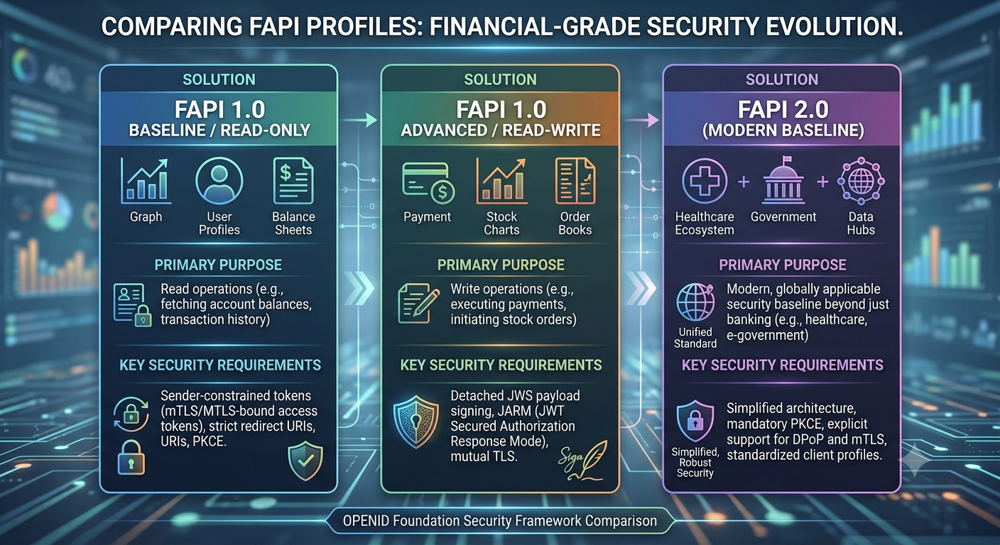

**FAPI** stands for **Financial-grade API** (now formally named the **Financial-grade Actionable API**).

It is not an API itself, nor is it just a financial endpoint like `/v1/accounts` or `/v1/payments`. Instead, **FAPI is a set of strict security and technical profiles built on top of standard OAuth 2.0 and OpenID Connect (OIDC)**, maintained by the OpenID Foundation (OIDF).

---

### Why Standard OAuth 2.0 Wasn't Enough

Standard OAuth 2.0 was designed for consumer-grade web apps (e.g., using "Log in with Google" to access Spotify). It allows:

* **Bearer tokens**: If an attacker intercepts the token via a man-in-the-middle attack or server log leak, they can reuse it directly (token replay).
* **Vulnerable redirect flows**: Authorization codes can potentially be intercepted without proof of possession.
* **Loose cryptographic requirements**: Basic signature algorithms (or unverified responses) are often permitted.

In banking, insurance, and healthcare, a stolen token could mean unauthorized fund transfers or catastrophic data breaches. FAPI was created to eliminate these loopholes.

---

### Key Capabilities & Requirements of FAPI

* **Sender-Constrained Tokens:** FAPI mandates that tokens are bound cryptographically to the client making the request. Even if a token is stolen, it cannot be used without:
* **mTLS (RFC 8705):** The token is cryptographically bound to the client's TLS certificate.
* **DPoP (Demonstrating Proof-of-Possession, RFC 9449):** The client signs each API request with a private key.

* **PKCE Everywhere:** Mandates Proof Key for Code Exchange (RFC 7636) even for confidential clients to prevent authorization code interception.
* **Non-Repudiation (JWS Signatures):** Requires critical payloads (like payment initiation) to be digitally signed using detached JSON Web Signatures (JWS) so neither party can deny sending or receiving the exact transaction data.
* **Stronger Cipher Suites:** Prohibits legacy cryptographic algorithms and mandates strict TLS 1.2/1.3 configurations with modern signing algorithms (e.g., `PS256` or `ES256`).
* **State & Intent Protection:** Mandates the use of signed request objects (JAR / JWT-Secured Authorization Request) and cryptographic nonces to defeat tampering and replay attacks.

---

### FAPI Evolution

---

### Where It Is Used

FAPI forms the mandatory technical and security backbone of global Open Banking and data-sharing frameworks:

* **UK Open Banking** (Open Banking Implementation Entity / OBIE)
* **Europe PSD2 / NextGenPSD2**
* **Australia CDR** (Consumer Data Right)
* **Brazil Open Finance**