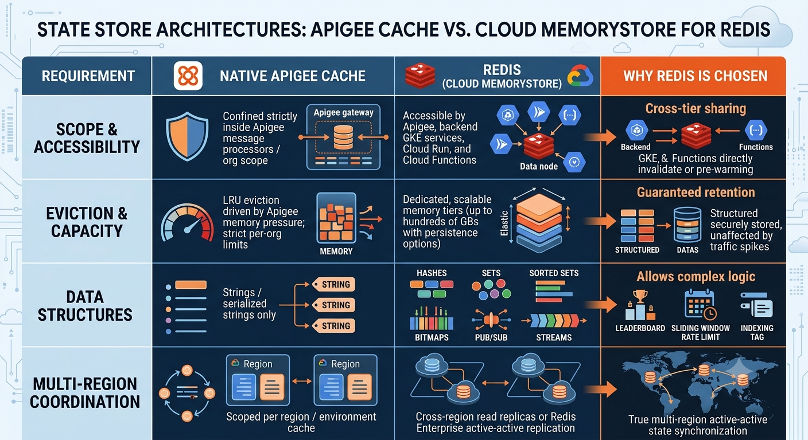

**Redis** (Remote Dictionary Server) is an in-memory, key-value data structure store used as a distributed cache, message broker, and low-latency database. In GCP, it is provided primarily as a managed service via **Google Cloud Memorystore for Redis** (or self-hosted on GKE / Compute Engine).

In an Apigee architecture, Redis acts as a high-speed, distributed state store that complements or offloads Apigee's internal caching layers.

---

### What Things Redis Manages in an Apigee & GCP Architecture

* **Distributed Session & State Storage:** Manages centralized user sessions, shopping carts, or multi-step checkout state across distributed microservices.
* **Shared Rate Limiting & Sliding Windows:** Enforces dynamic or global token-bucket counters when limits need to coordinate across multi-region Apigee deployments and backend services simultaneously.
* **API Response & Object Caching:** Stores serialized backend payload responses, expensive SQL query outputs, or aggregated master data to prevent hitting downstream mainframes or databases.
* **Idempotency Keys:** Tracks unique transaction IDs (e.g., `Idempotency-Key` headers in payment APIs) for a TTL window (e.g., 24 hours) to prevent duplicate execution of payments or orders.
* **Token Blacklisting / Revocation Lists:** Tracks revoked JWTs or logged-out access tokens before their natural expiry so gateways can instantly reject them.

---

### Why We Use Redis with Apigee (Apigee Cache vs. Redis)

Apigee comes with its own native cache (`PopulateCache`, `LookupCache`, `InvalidateCache`), but enterprise systems still introduce Redis for specific architectural needs:



---

### How to Integrate Redis with Apigee

Because Redis uses the **RESP (REdis Serialization Protocol)** over TCP (port 6379), an HTTP-native gateway like Apigee X or Edge cannot open raw Redis sockets directly in standard XML policies. Integration follows two primary patterns:

#### 1. REST / Sidecar Cache Gateway (Recommended for Apigee X)

Apigee speaks HTTP/REST to a microservice or an HTTP-to-Redis proxy (such as a lightweight Go/Node.js service or Webdis) deployed in the same VPC via Private Service Connect (PSC) or VPC Peering:

```
[Client] 
   │ (HTTPS)
   ▼
[Apigee X] 
   │ (Internal HTTP via ServiceCallout or TargetEndpoint)
   ▼
[Redis HTTP Adapter / Cloud Run / GKE]
   │ (RESP / TCP 6379)
   ▼
[Cloud Memorystore for Redis]

```

* **Read Flow:** Apigee executes a `ServiceCallout` to `GET /cache/{key}`. If a `200 OK` is returned with data, Apigee skips the backend target and responds immediately.
* **Write/Invalidation Flow:** Apigee sends `POST /cache/{key}` in the `PostFlow` or backends invalidate keys directly when database updates occur.

#### 2. JavaCallout with a Redis Client (Apigee Edge On-Prem / Hybrid)

For deployments where custom Java code execution with outbound socket access is supported:

* Bundle a Java client library (e.g., **Jedis** or **Lettuce**).
* Implement an Apigee `JavaCallout` policy to execute `jedis.get(key)` or `jedis.setex(key, ttl, value)`.
* Inject connection parameters (host, port, auth password) securely via Encrypted KVMs or environment variables.

---

### Constraints and Considerations

* **Network Latency (The Extra Hop):** Calling Redis over HTTP via `ServiceCallout` adds 2–6 ms. If sub-millisecond cache latency is required, rely on Apigee’s native `LookupCache` first, falling back to Redis for misses (L1/L2 caching strategy).
* **VPC Networking in Apigee X:** Cloud Memorystore instances require private IP access. Apigee X (which runs in a Google-managed VPC) needs proper VPC Peering or PSC attachment to reach Memorystore in your project VPC.
* **Cost & High Availability:** Memorystore requires standard tier (with replica and automatic failover) for production SLAs. Apigee's built-in cache is included with the runtime platform without separate infrastructure provisioning.
* **Serialization Overhead:** Data passed through Apigee must be serialized (typically JSON strings), increasing payload processing and memory footprint if caching megabyte-sized datasets.