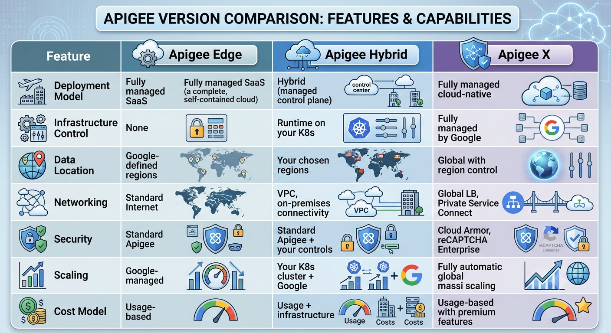

```markdown
# Technical Deep Dive: Apigee Evolution

## 🎯 **Overview: Three Generations of Apigee**

### **Timeline & Evolution:**
```
Apigee Edge (2016) → Apigee Hybrid (2019) → Apigee X (2021)
Legacy Cloud        Hybrid Flexibility    Google Cloud Native
```

---

## 🔧 **Apigee Edge - The Foundation**

### **Architecture:**
```
[Client] → [Apigee Edge Cloud] → [Backend]
                    ↑
            Managed by Google
            Multi-tenant SaaS
```

### **Key Characteristics:**
- **Fully Managed SaaS:** Google manages everything
- **Multi-tenant:** Shared infrastructure
- **Fixed Regions:** Limited geographic control
- **Established Feature Set:** Mature, battle-tested

### **Use Cases:**
✅ **Quick Startups** - Rapid time to market  
✅ **Standard Requirements** - No special compliance needs  
✅ **Cost-Effective** - No infrastructure management  
✅ **Proven Platform** - Extensive documentation and community  

### **Limitations:**
❌ **Limited Control** - Cannot customize infrastructure  
❌ **Fixed Regions** - Limited deployment flexibility  
❌ **Vendor Lock-in** - Fully dependent on Google cloud  
❌ **Scaling Constraints** - Google-managed scaling  

### **Interview Explanation:**
"Apigee Edge was the original SaaS offering - perfect for companies wanting a fully managed API gateway without infrastructure concerns. It's like renting an apartment: everything is maintained for you, but you can't modify the building structure."

---

## ⚡ **Apigee Hybrid - Flexibility & Control**

### **Architecture:**
```
[Client] → [Google Cloud LB] → [Hybrid Runtime (Your K8s)] → [Backend]
                              ↑
                      Your control, Google management
```

### **Key Characteristics:**
- **Hybrid Deployment:** Runtime on your Kubernetes cluster
- **Control Plane Managed:** Google manages configuration, you manage runtime
- **Data Residency:** Deploy runtime in specific regions/countries
- **VPC Integration:** Connect to on-premises systems

### **Use Cases:**
✅ **Data Sovereignty** - Compliance with local data laws  
✅ **Hybrid Environments** - Connect cloud and on-premises  
✅ **Custom Requirements** - Specific security or network needs  
✅ **Existing Kubernetes** - Leverage current K8s investments  

### **Technical Implementation:**
```yaml
# Hybrid Runtime Configuration
apiVersion: apigee.cloud.google.com/v1
kind: ApigeeOrganization
metadata:
  name: my-org
spec:
  runtime:
    locations:
    - name: us-central1
      cluster: my-gke-cluster
    - name: europe-west1  
      cluster: my-eu-cluster
```

### **Interview Explanation:**
"Apigee Hybrid gives you the best of both worlds: Google manages the control plane while you control the runtime deployment. It's like owning a condo - you own your unit (runtime) but the building management (Google) handles common areas and services."

---

## 🚀 **Apigee X - Google Cloud Native**

### **Architecture:**
```
[Client] → [Google Global LB] → [Apigee X Runtime] → [Backend Services]
                   ↑                    ↑
           Global load balancing   Fully managed runtime
           Cloud Armor integration  Automatic scaling
```

### **Key Characteristics:**
- **Fully Cloud Native:** Built on Google Cloud infrastructure
- **Global Load Balancing:** Automatic traffic distribution
- **Advanced Security:** Cloud Armor, reCAPTCHA Enterprise
- **AI/ML Integration:** Apigee Analytics with BigQuery ML

### **Use Cases:**
✅ **Global Scale** - Worldwide API distribution  
✅ **Advanced Security** - Enterprise-grade protection  
✅ **AI/ML Analytics** - Predictive API insights  
✅ **Google Ecosystem** - Deep integration with GCP services  

### **Key Differentiators:**
```yaml
# Apigee X Exclusive Features:
- Cloud Armor Integration: DDoS protection and WAF
- reCAPTCHA Enterprise: Advanced bot detection
- Global Load Balancer: Automatic failover and routing
- Private Service Connect: Secure backend connectivity
- AI-Powered Analytics: Anomaly detection and predictions
```

### **Interview Explanation:**
"Apigee X represents the evolution to fully cloud-native architecture. It's like moving from a condo to a smart home - everything is integrated, automated, and enhanced with AI capabilities. The global load balancing and advanced security make it ideal for enterprises with worldwide presence."

---

## 📊 **Feature Comparison Table**



---

## 🔧 **Migration Considerations**

### **Edge → Hybrid Migration:**
```yaml
Preparation:
  - Assess Kubernetes readiness
  - Plan network connectivity
  - Data migration strategy
  - Team skill development

Technical Steps:
  1. Set up Kubernetes cluster
  2. Install Hybrid runtime
  3. Migrate API proxies
  4. Update DNS and traffic routing
  5. Validate and cutover
```

### **Edge/Hybrid → X Migration:**
```yaml
Benefits:
  - Reduced operational overhead
  - Enhanced security features
  - Global scalability
  - Advanced analytics

Considerations:
  - Feature parity validation
  - Cost analysis
  - Training for new capabilities
  - Phased migration approach
```

---

## 💡 **Decision Framework for Interviews**

### **When to Choose Edge:**
- "For startups or projects with standard requirements"
- "When you want fastest time-to-market with minimal ops"
- "Budget constraints where infrastructure costs are concern"

### **When to Choose Hybrid:**
- "For enterprises with compliance or data residency needs"
- "When you have existing Kubernetes expertise and infrastructure"
- "Hybrid cloud scenarios with on-premises integration"

### **When to Choose X:**
- "For global enterprises needing worldwide API distribution"
- "When advanced security like DDoS protection is critical"
- "Companies deeply invested in Google Cloud ecosystem"
- "When you want AI-powered API analytics and insights"

---

## 🎯 **Real Interview Scenarios**

### **Scenario 1: Financial Services Company**
**Question:** "We have data residency requirements in EU and need to connect to on-prem mainframes. Which Apigee version?"
**Answer:** "Apigee Hybrid is your best choice. You can deploy runtime clusters in EU regions for data sovereignty and use Hybrid's VPC connectivity to securely reach your on-premises mainframes."

### **Scenario 2: Global E-commerce Platform**
**Question:** "We're experiencing DDoS attacks and need global low-latency. Recommendations?"
**Answer:** "Apigee X with its Cloud Armor integration for advanced DDoS protection and global load balancer for optimal routing. The automatic scaling handles traffic spikes during sales events."

### **Scenario 3: Cost-Conscious Startup**
**Question:** "We're a startup with limited DevOps resources. What's simplest?"
**Answer:** "Start with Apigee Edge - it's fully managed so you focus on API development, not infrastructure. As you grow, you can evaluate Hybrid or X based on evolving needs."

---

## 🚀 **Key Interview Takeaways**

1. **Understand Business Context:** Different versions suit different organizational needs
2. **Articulate Trade-offs:** Control vs convenience, features vs cost
3. **Migration Experience:** Discuss real migration stories if you have them
4. **Future Vision:** Show awareness of where Apigee is heading
5. **Practical Knowledge:** Know which features are exclusive to each version

**Remember:** This demonstrates strategic thinking about platform selection, not just technical implementation!
```
