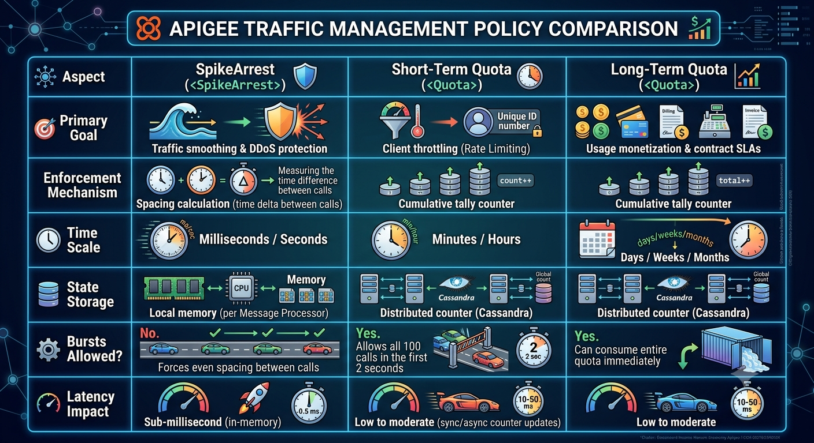

You are correct: **there is no `<RateLimit>` policy in Apigee.**

In Apigee, **Rate Limiting** is a conceptual capability rather than a standalone policy. It is implemented using:

1. **`SpikeArrest`:** For operational traffic smoothing and surge suppression (per-second/per-minute micro-intervals).
2. **`Quota`:** For enforcing actual count limits over short or long time windows (per minute, hour, day, month, or customized billing cycles).
3. **`ConcurrentRatelimit`:** Specifically for restricting concurrent connections to fragile backend targets.

Here is the revised technical guide, correctly structured around Apigee's actual traffic management policies.

---

```markdown
# Technical Deep Dive: Apigee Traffic Management Policies

## 🎯 Overview: Core Traffic Management Policies

Apigee provides two primary traffic policies for incoming request management, alongside concurrent connection controls:

### 1. SpikeArrest 🛡️
* **Purpose:** Traffic smoothing and sudden surge/DDoS suppression.
* **Scope:** Micro-burst protection (per-second or per-minute intervals).
* **Granularity:** Global or grouped by identifier (e.g., IP, developer ID).

### 2. Quota 📊
* **Purpose:** Both short-term rate limiting (throttling per minute/hour) and long-term business allowances (per day/month).
* **Scope:** Enforces explicit numeric call limits over defined time windows.
* **Granularity:** Scoped by API Product, developer, client ID, or custom variables.

### 3. ConcurrentRatelimit ⚙️ *(Backend Protection)*
* **Purpose:** Limits simultaneous active connections dispatched to a target endpoint.
* **Scope:** Backend connection capacity rather than incoming request counts.

---

## 🔧 SpikeArrest — The Traffic Smoother

### How It Works:
```xml
<SpikeArrest name="SA-Protect-Backend">
    <!-- 30 requests per minute = smoothed to 1 request every 2 seconds -->
    <Rate>30pm</Rate>
    <!-- Group per client so one user doesn't exhaust everyone's capacity -->
    <Identifier ref="client_ip"/>
</SpikeArrest>

```

### Key Characteristics:

* **Smoothing Algorithm:** Divides the rate into micro-intervals (e.g., `10ps` permits 1 request every 100ms; `30pm` permits 1 request every 2 seconds). Requests arriving faster than the calculated interval are immediately rejected with a `429 Too Many Requests`.
* **In-Memory Execution:** Handled locally within the runtime/Message Processor (MP) memory. It does not synchronize state across all nodes via Cassandra, making execution nearly instantaneous.
* **No Roll-over / No Counter:** It does not maintain a cumulative counter that resets at the end of a minute; it only checks the time elapsed since the previous allowed call.

---

## 📊 Quota — Rate Limiting & Business Allowances

Because Apigee has no dedicated `<RateLimit>` policy, **the `<Quota>` policy handles both short-term rate limiting and business-tier quotas.**

### 1. Operational Rate Limiting (Short-Term Windows)

```xml
<!-- Rate Limiting: 100 requests every 1 minute per Client ID -->
<Quota name="Q-Rate-Limit-Per-Minute">
    <Allow count="100"/>
    <Interval>1</Interval>
    <TimeUnit>minute</TimeUnit>
    <Distributed>true</Distributed>
    <Synchronous>true</Synchronous>
    <Identifier ref="client_id"/>
</Quota>

```

### 2. Business Quota (Monetization & Monthly Plans)

```xml
<!-- Business Allowance: 50,000 requests per month -->
<Quota name="Q-Monthly-Monetization" type="calendar">
    <Allow count="50000"/>
    <Interval>1</Interval>
    <TimeUnit>month</TimeUnit>
    <StartTime>2026-01-01 00:00:00</StartTime>
    <Distributed>true</Distributed>
    <Identifier ref="client_id"/>
</Quota>

```

### Key Characteristics:

* **Distributed Counters:** Uses Cassandra to synchronize counters across all Message Processors.
* **Counting Modes:**
* `<Synchronous>true</Synchronous>`: Exact count precision across nodes, slight latency cost.
* `<Synchronous>false</Synchronous>`: Asynchronous counter sync; better performance, but minor burst overages may occur across nodes.


* **Interval Flexibility:** Supports `minute`, `hour`, `day`, `week`, and `month`.
* **Dynamic Allowances:** Can read limits dynamically from API Product attributes:
```xml
<Allow countRef="verifyapikey.Verify-API-Key.apiproduct.developer.quota.limit"/>

```


---

## 🎯 Policy Comparison: SpikeArrest vs. Quota



---

## 🔧 Real-World Layered Traffic Strategy

In an enterprise proxy, policies are chained sequentially in the `PreFlow`:

```xml
<PreFlow name="PreFlow">
    <Request>
        <!-- Step 1: Immediate DDoS & surge smoothing -->
        <Step>
            <Name>SA-Global-Smoothing</Name>
        </Step>

        <!-- Step 2: Authenticate caller & resolve API Product -->
        <Step>
            <Name>VA-Verify-API-Key</Name>
        </Step>

        <!-- Step 3: Rate Limiting (e.g., 60 req/min to prevent noisy neighbors) -->
        <Step>
            <Name>Q-Throttling-Per-Minute</Name>
        </Step>

        <!-- Step 4: Monetization / Tiered Quota (e.g., 100,000 req/month) -->
        <Step>
            <Name>Q-Monthly-Tier-Limit</Name>
        </Step>
    </Request>
</PreFlow>

```

---

## 💡 Interview Clarifications & Scenarios

### 1. "How do you do Rate Limiting in Apigee?"

> *"Apigee does not have a separate `RateLimit` policy. Instead, rate limiting is implemented via the **`Quota`** policy configured for short intervals (e.g., 1 minute or 1 hour), often paired with an `<Identifier>` like `client_id` or `client_ip`. For smoothing traffic spikes, we pair this with a **`SpikeArrest`** policy."*

### 2. "Why not use SpikeArrest as a Rate Limiter?"

> *"SpikeArrest doesn't count total volume; it enforces interval spacing. If you configure `60pm`, SpikeArrest allows 1 request every 1 second. A client attempting to send 5 requests within 200 milliseconds will have 4 requests rejected—even though they haven't exceeded 60 requests in the minute."*

### 3. "How do you minimize Quota performance overhead at high scale?"

> *"Set `<Synchronous>false</Synchronous>` and adjust `<SyncInterval>`. This batches counter synchronization to Cassandra asynchronously instead of halting every API thread on a shared distributed write."*

```

```