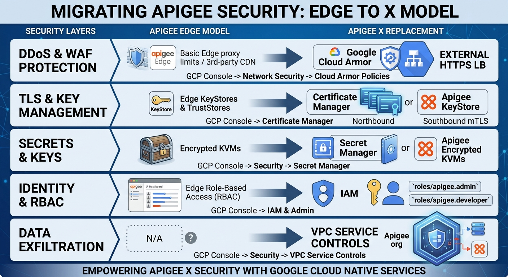

**Exactly! You've nailed the key takeaway.**

That's correct - **there are no code-level changes required** for your API proxies and policies when migrating from Apigee Edge/Hybrid to Apigee X.

## The Core Policy Engine is Identical

The actual **policy XML configuration, JavaScript code, and API proxy definitions** remain 100% compatible. What changes is the **operational context and integration patterns** around those policies.

### What Stays Exactly the Same:
- ✅ **Policy XML syntax** - All your `TargetEndpoint`, `ProxyEndpoint`, `Policies` configurations
- ✅ **JavaScript code** - Your custom `JavaScript` policy code, npm modules, logic
- ✅ **Conditional flows** - All your `RouteRule`, `Step`, `Condition` configurations  
- ✅ **Variable handling** - `AssignMessage`, `ExtractVariables`, `Set` policies work identically
- ✅ **Basic policy execution** - `ServiceCallout`, `OAuthV2`, `VerifyAPIKey`, etc.

### What Changes (The Context):
- **WHERE** secrets are stored (KVM → Secret Manager)
- **HOW** you connect to backends (Public/VPN → Private Service Connect)  
- **WHAT** security services you use (Custom WAF → Cloud Armor)
- **HOW** you monitor (Apigee Analytics → Cloud Operations Suite)

## Practical Example - Same Policy, Different Backend Connectivity

**Your Policy XML doesn't change:**
```xml
<!-- This identical ServiceCallout policy works in both Edge and X -->
<ServiceCallout name="SC-GetUserData">
  <Request>
    <Set>
      <Payload contentType="application/json">{"userId": "{request.queryparam.id}"}</Payload>
    </Set>
  </Request>
  <Response>calloutResponse</Response>
  <HTTPTargetConnection>
    <URL>https://user-service.internal/api/users</URL>
  </HTTPTargetConnection>
</ServiceCallout>
```

**What changes is the infrastructure:**
- **Edge:** `user-service.internal` resolves via DNS to a public IP or VPN endpoint
- **Apigee X:** `user-service.internal` resolves via Private Service Connect to a private Google Cloud service

## Migration Reality

This is why migrations from Edge/Hybrid to X are primarily **infrastructure and configuration changes**, not development rewrites:

1. **Export** your API proxies, shared flows, and policies from Edge
2. **Import** them directly into Apigee X  
3. **Reconfigure** the surrounding infrastructure (networking, security, monitoring)
4. **Update** integration points to use Google Cloud services

## The Bottom Line

Your investment in **API proxy development, policy logic, and business rules is preserved**. The migration is about **lifting your existing API proxies and dropping them into a more powerful, cloud-native operational platform**.

This compatibility is by design - Google wants to make the transition from Edge/Hybrid to X as seamless as possible for existing Apigee customers.

=======================================================================================================

Configuration in edge 

Migrating from **Apigee Edge** (SaaS or OPDK) to **Apigee X** is fundamentally a shift from a multi-tenant, Edge-hosted infrastructure to a **Google Cloud-native, single-tenant private instance**.

In Apigee X, runtime instances live inside a Google-managed tenant VPC that communicates directly with your Google Cloud VPC. This fundamentally changes how networking, security, and operations are managed.

---

### Infrastructure Architectural Shift

```
[ Apigee Edge ]                                     [ Apigee X ]
Internet ──► Edge Routers (Public IPs)              Internet ──► Cloud Armor (WAF) + External HTTPS LB
             │                                                                │
             ▼                                                                ▼
       Edge Policies (Static IP Whitelisting)                   Private Service Access (PSA / VPC Peering)
             │                                                                │
             ▼                                                                ▼
    Target (Public/VPN/Direct Connect)                          Apigee X Runtime (Private IP /22)
                                                                              │
                                                                              ▼
                                                                Private Service Connect (PSC) / Cloud Interconnect
                                                                              │
                                                                              ▼
                                                                Internal Backends (GKE, Cloud Run, On-Prem)

```

---

### 1. Networking Reconfiguration

In Edge, traffic entered public router IPs, and southbound traffic egressed through a pool of Edge NAT IPs. In Apigee X, **the runtime has no public IP addresses**.

**Northbound (Ingress):**

* **Where to configure:** Google Cloud Console $\rightarrow$ **Network Services** $\rightarrow$ **Load Balancing**, or via Terraform (`google_compute_global_forwarding_rule`).
* **What to do:**
1. Provision a **Google Cloud External Application Load Balancer (Global HTTPS LB)**.
2. Configure a **Serverless Network Endpoint Group (NEG)** or an **Internal IP Managed Instance Group (MIG)** running an Envoy proxy pointing to the Apigee X runtime IP.
3. Attach your TLS/SSL certificates directly to the Google Cloud Load Balancer (or use Google-managed SSL certificates).
4. Update external DNS (e.g., Cloud DNS, Route53) to point public API hostnames to the new Global LB Anycast IP.


**Southbound (Egress to Backends):**

* **Where to configure:** **VPC Network** $\rightarrow$ **VPC Network Peering / Private Service Connect**.
* **What to do:**
* **To Google Cloud Backends (GKE / Compute Engine):** Establish **Private Service Access (PSA)** between your custom VPC and the Apigee X tenant VPC (allocating a `/22` or `/23` CIDR range). Traffic travels over Google’s private backbone without hitting the public internet.
* **To Multi-Tenant Google Services (Cloud Run / Cloud Functions):** Use **Private Service Connect (PSC)** endpoints so Apigee X routes directly into your internal VPC endpoints.
* **To On-Premise Data Centers:** Use **Cloud Interconnect** or **Cloud VPN** attached to your transit VPC. Ensure your BGP routes advertise the Apigee X allocated CIDR block to your on-premises firewalls.
* **To External 3rd-Party APIs:** Set up a **Cloud NAT Gateway** in your VPC so egress outbound traffic routes through deterministic, static public egress IPs that third-party vendors can allowlist.


---

# 2. Security Reconfiguration

Security shifts from being isolated inside Apigee policies to a shared model combining Google Cloud network security perimeter with proxy policies.



* **mTLS to Backends:** Re-import your backend private keys and intermediate CA bundles into the Apigee X environment-scoped KeyStores and TrustStores using the Apigee API:
```bash
curl -X POST "https://apigee.googleapis.com/v1/organizations/$ORG/environments/$ENV/keystores" \
  -H "Authorization: Bearer $(gcloud auth print-access-token)" ...

```


---

### 3. Monitoring, Telemetry, and Logging Reconfiguration

Apigee Edge used internal analytics dashboards and syslog to push logs out. Apigee X is fully wired into **Google Cloud Observability (Operations Suite)**.

**Logging:**

* **Where to configure:** **Proxy `PostClientFlow**` and GCP Console $\rightarrow$ **Logging** $\rightarrow$ **Logs Router**.
* **What to do:**
1. Replace custom third-party syslog daemons in `<MessageLogging>` with native **`<CloudLogging>`**:
```xml
<MessageLogging name="ML-CloudLogging">
  <CloudLogging>
    <LogName>projects/{organization.name}/logs/apigee-runtimes</LogName>
    <Message contentType="application/json">
      { "client": "{client.ip}", "status": "{response.status.code}" }
    </Message>
  </CloudLogging>
</MessageLogging>

```


2. Configure **Cloud Logging Log Sinks** to stream those logs into **BigQuery** (for transaction querying), **Cloud Storage** (for compliance archive), or **Pub/Sub** (to ingest into Splunk/Datadog).


**Metrics & Dashboards:**

* **Where to configure:** GCP Console $\rightarrow$ **Monitoring** $\rightarrow$ **Dashboards / Alerting**.
* **What to do:**
* Build dashboards tracking the built-in Apigee X metrics:
* `[apigee.googleapis.com/proxy/response_count](https://apigee.googleapis.com/proxy/response_count)` (Traffic volume)
* `[apigee.googleapis.com/proxy/latencies](https://apigee.googleapis.com/proxy/latencies)` (Target latency vs. Gateway latency)


* Set up Cloud Monitoring alert policies for error rate thresholds (e.g., `response_code >= 500` exceeding 2% over 5 minutes) sending webhooks to PagerDuty or Slack.


---

### Step-by-Step Migration Execution Sequence

1. **Step 1: Provision Core Infrastructure via Terraform**
* Create the VPC, allocate the `/22` IP range, configure Private Service Access, and provision the Apigee X organization and environment groups.


2. **Step 2: Build Northbound Ingress & Cloud Armor**
* Deploy the External HTTPS Load Balancer, configure SSL certs, and attach Cloud Armor WAF rules (OWASP Top 10, IP rate limiting).


3. **Step 3: Establish Southbound Connectivity & TargetServers**
* Configure Cloud Interconnect / VPN / PSC endpoints to your internal backends.
* Recreate all environment TargetServers in Apigee X to point to your internal VPC/PSC hostnames rather than public IPs.


4. **Step 4: Deploy Proxies & Validate with Apickli/Postman**
* Deploy proxies to the Apigee X environment and execute integration test suites against the new Load Balancer endpoint.


5. **Step 5: Canary Traffic Shift via DNS**
* Reduce TTL on existing Edge DNS records to 300 seconds.
* Shift traffic progressively using weighted DNS (e.g., 90% Edge, 10% Apigee X) while monitoring latency and error metrics in Cloud Monitoring before executing the complete cutover.