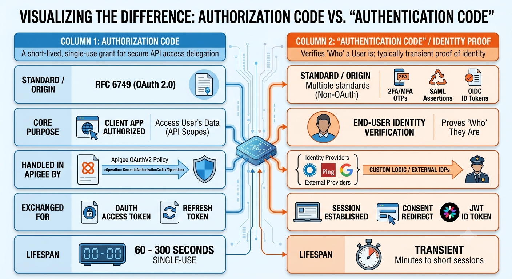

In Apigee and standard web security architecture, **Authorization Code** is a formal, standardized concept within the OAuth 2.0 specification, whereas **Authentication Code** is not an OAuth 2.0 entity—it typically refers to identity verification tokens (such as MFA OTPs or ID Tokens).


---

**Authorization Code in Apigee**

The Authorization Code is an intermediate, opaque string issued by Apigee to an external application (the client) during an interactive user login and consent flow.

* **Generation**: Handled via the `OAuthV2` policy with the `GenerateAuthorizationCode` operation after user authentication succeeds:
```xml
<OAuthV2 name="OAuthV2-GenerateAuthCode">
    <Operation>GenerateAuthorizationCode</Operation>
    <ClientId>request.formparam.client_id</ClientId>
    <RedirectURI>request.formparam.redirect_uri</RedirectURI>
    <ResponseType>request.formparam.response_type</ResponseType>
    <Scope>request.formparam.scope</Scope>
    <ExpiresIn>300000</ExpiresIn>
</OAuthV2>

```


* **Redemption**: The client's backend sends this code back to Apigee along with its client secret using `GenerateAccessToken` to get the final API access token:
```xml
<OAuthV2 name="OAuthV2-ExchangeCodeForToken">
    <Operation>GenerateAccessToken</Operation>
    <Code>request.formparam.code</Code>
    <GrantType>request.formparam.grant_type</GrantType>
    <ClientId>request.formparam.client_id</ClientId>
</OAuthV2>

```


---

**"Authentication Code" in API Architecture**

When "Authentication Code" appears in design discussions, it generally refers to one of three authentication mechanisms handled before or alongside Apigee:

* **MFA / SMS / TOTP Code**: A 6-digit numeric one-time password (OTP) verified via an identity provider or custom backend before Apigee issues any OAuth code.
* **OIDC ID Token**: OpenID Connect (built on OAuth 2.0) issues an `id_token` (a signed JWT) alongside or instead of an access token to represent the authenticated identity of the user. Apigee verifies this using policies like `VerifyJWT`.
* **IdP Session / Auth Response**: The internal state or session ticket issued by corporate IdPs (like Azure AD, PingFederate, or Okta) during federated SAML/OIDC handshakes.