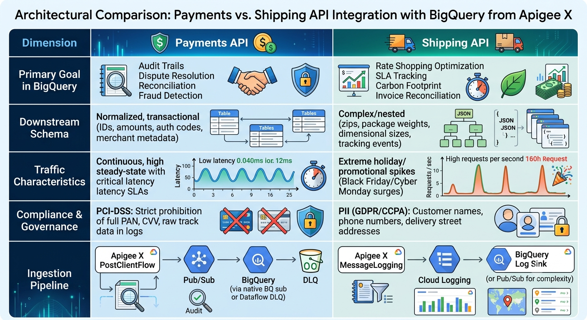

For both **Payments** and **Shipping** APIs in Apigee X, neither sending Apigee Analytics data nor using direct BigQuery callouts/extensions meets production standards.

Apigee Analytics is constrained to platform operations (latencies, status codes), and direct BigQuery API calls block client execution and risk quota throttling. The standard production architecture for both domains is an **asynchronous, decoupled pipeline into BigQuery** using **Pub/Sub** or **Cloud Logging**.

---

# Architectural Comparison: Payments vs. Shipping


 


### Ingestion Strategies in Apigee X

#### Pattern A: Pub/Sub Decoupled Ingestion (Best for Payments)

Critical transactions demand guaranteed delivery, schema enforcement, and dead-letter queues (DLQ) without adding latency to the client response.

```
Client ──► [Apigee X Request Flow] ──► Target Payment Processor
                 │
                 ▼ (Returns HTTP 200 to client first)
         [PostClientFlow]
                 │
                 ▼ (Async dispatch / PublishMessage)
          [Cloud Pub/Sub]
                 │
                 ├──► [Dead Letter Queue (DLQ)] (for invalid schemas)
                 ▼
     [Pub/Sub BigQuery Subscription / Dataflow]
                 │
                 ▼
         [BigQuery Dataset]

```

* **Why it fits Payments:** `PostClientFlow` executes after the response is returned to the client, adding zero latency. Pub/Sub provides at-least-once delivery guarantees, and configuring a dead-letter queue ensures no transaction log is dropped if a schema mismatch occurs.

#### Pattern B: MessageLogging to Cloud Logging Sink (Best for Shipping)

Shipping APIs often require simple event recording across multiple operations (rate quotes, label purchases, dispatch notifications).

```
Client ──► [Apigee X Proxy] ──► Shipping Carrier API
                 │
                 ▼ (PostClientFlow: Native GCP MessageLogging)
         [Cloud Logging]
                 │
                 ▼ (Export Sink: zero-code streaming filter)
         [BigQuery Dataset]

```

* **Why it fits Shipping:** Writing structured JSON via the native `MessageLogging` policy to Cloud Logging requires minimal infrastructure. A **Cloud Logging Sink** streams those logs straight to BigQuery automatically. It handles holiday burst volumes seamlessly and buffers traffic spikes without manual scaling.

---

### Data Handling & Security Guidelines

* **Payments APIs (PCI-DSS):**
* Use an `AssignMessage` or `JavaScript` policy to strictly mask or eliminate primary account numbers (PAN), CVVs, and plain passwords before dispatching the payload.
* Store only tokenized identifiers (e.g., `paymentToken`, `chargeId`, `authCode`, `last4`) in BigQuery.


* **Shipping APIs (PII & Schema Flexibility):**
* Avoid sending recipient personal names and exact door-level addresses into the analytics layer if aggregate delivery analysis (city, postal code, state, zone) suffices.
* Use BigQuery JSON columns (`JSON` data type) to store arbitrary carrier responses, as carrier schemas (FedEx, UPS, DHL) frequently vary in their nested breakdowns of fees and surcharges.