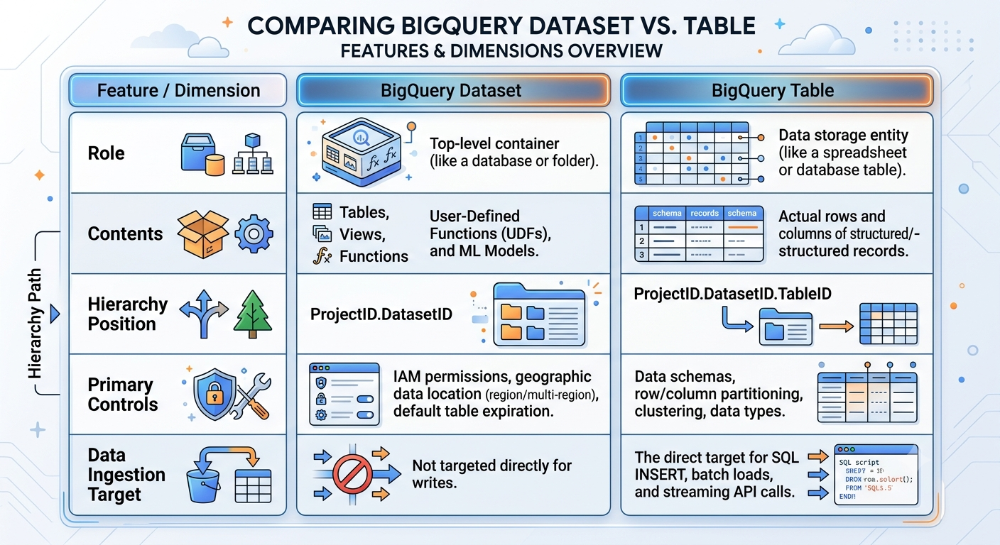

When sending custom analytics data to Google BigQuery (whether via Apigee extensions, Google Cloud Logging exports, or direct ingestion APIs), the difference between a **Dataset** and a **Table** comes down to **organizational container vs. actual structured storage**.

---

# Core Comparison




### How They Apply to Custom Data Analytics

**1. The Dataset handles Governance & Location:**

* **Access Control (IAM):** You grant permissions at the dataset level (e.g., granting Apigee's service account `BigQuery Data Editor` on `analytics_prod_dataset`).
* **Data Residency:** Determines where your analytics data physically lives (e.g., `asia-south1`, `US`, `EU`). All tables created inside inherit this location.
* **Lifecycle Rules:** Configures default retention (e.g., auto-delete analytics tables older than 90 days).

**2. The Table handles Schema & Storage:**

* **Schema Definition:** Defines the exact columns for your custom metrics (e.g., `client_ip STRING`, `response_time_ms INT64`, `proxy_name STRING`, `timestamp TIMESTAMP`).
* **Query Performance & Cost Optimization:** Configures **time-partitioning** (e.g., partitioned by `timestamp` column) and **clustering** (e.g., clustered by `proxy_name` or `status_code`) so analytical queries only scan relevant slices of data, drastically cutting query cost and latency.

---

### Practical Example

If you stream custom API analytics from Apigee to BigQuery:

```text
my-gcp-project                  (GCP Project)
 └── apigee_analytics_us         (Dataset: sets US multi-region, grants write access)
      ├── proxy_traffic_v1       (Table: stores runtime logs partitioned by day)
      ├── error_logs_v1          (Table: stores 4xx/5xx payload alerts)
      └── latency_metrics_v1     (Table: stores response time percentiles)

```

To stream or write records, your ingestion payload targets the table directly:
`my-gcp-project.apigee_analytics_us.proxy_traffic_v1`