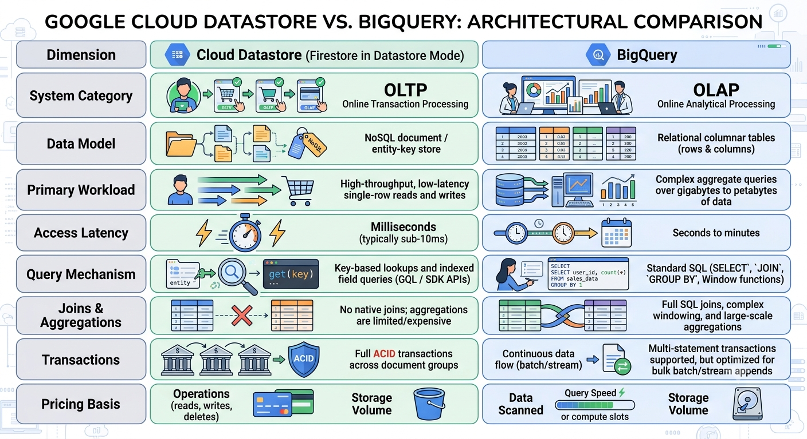

The primary difference between **Google Cloud Datastore** (now operating as **Firestore in Datastore mode**) and **Google BigQuery** is their fundamental architecture and operational purpose: **Datastore is an operational NoSQL database (OLTP)** designed for application backends, while **BigQuery is an analytical data warehouse (OLAP)** designed for querying massive datasets.

---

# Core Comparison




### Key Architectural Differences

**1. Row-Oriented vs. Columnar Storage**

* **Datastore** retrieves entire entities by their key or an index. It is optimized to quickly serve user profile details, shopping cart contents, or a specific API state to a web/mobile client.
* **BigQuery** stores data column-by-column. When running a query like `AVG(response_time)`, BigQuery reads only that single column across billions of rows, skipping the rest of the table entirely.

**2. Transactional vs. Analytical Processing**

* **Datastore** provides atomic writes and strong consistency for individual keys and entity groups. It is built to power the transactional operational layer of an application where thousands of users are reading and updating records concurrently.
* **BigQuery** is append-heavy. While it supports `UPDATE` and `DELETE`, modifying individual records is slow and costly compared to running batch transformations or appending immutable audit/traffic logs.

---

### Typical Usage in an Application Architecture

They frequently complement each other in production systems:

```text
[ Client / Web App ]
         │
         ▼
    [ Apigee / API Gateway ]
         │
         ├── (Reads / Writes User State, fast CRUD) ────► [ Cloud Datastore ]
         │
         └── (Streams API Analytics & Access Logs) ─────► [ BigQuery ]
                                                                │
                                                                ▼
                                                        [ Looker / BI Dashboard ]

```

* Use **Datastore** when your application needs real-time, low-latency CRUD operations for user sessions, catalogs, or app configurations.
* Use **BigQuery** when you need to store months of historical events, logs, or metrics to run reporting dashboards, trend analyses, or machine learning models.