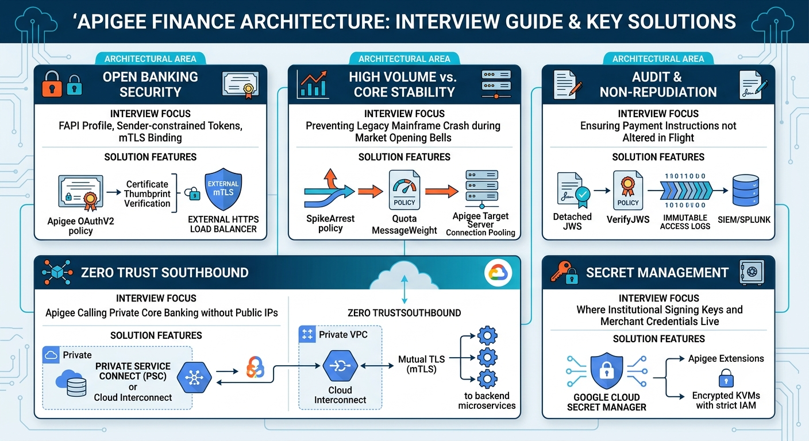
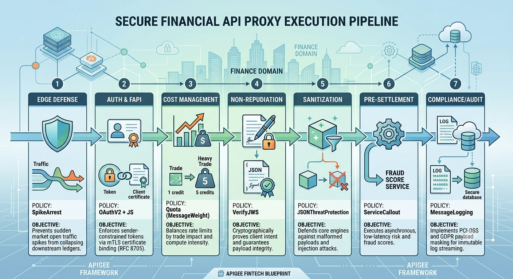

In banking, wealth management, and capital markets, Apigee functions as the secure perimeter, protocol translator, and regulatory enforcement engine. For interviews, architects expect you to design across four distinct tiers: **Edge/Perimeter**, **API Management (Apigee)**, **Private Ingress/Core Banking**, and **Governance/Audit**.

---

### High-Level Architecture Diagram

```
       [ FinTech Apps / Portals / TPP (Open Banking) ]
                              │
                    HTTPS (TLS 1.3 / mTLS)
                              ▼
 ┌──────────────────────────────────────────────────────────┐
 │  Perimeter & Edge Tier (Cloud Armor / WAF + Ext LB)     │
 │  • DDoS mitigation & Geo-blocking (OFAC/FATF sanction)   │
 │  • OWASP Top 10 API Threat Protection                    │
 └────────────────────────────┬─────────────────────────────┘
                              │
                              ▼
 ┌──────────────────────────────────────────────────────────┐
 │  Apigee API Gateway Tier (Northbound to Southbound)      │
 │  • FAPI / OAuth2 / MTLS Validation (RFC 8705)            │
 │  • SpikeArrest & Tiered Quotas (by Trading Tier)         │
 │  • Schema Validation (ISO 20022 / FIX / JSON Schema)     │
 │  • Field-Level Encryption & PII Tokenization             │
 │  • Non-repudiation Signing (e.g., JWS for Transfers)     │
 └──────────────┬────────────────────────────┬──────────────┘
                │                            │
      Private Service Connect      VPC Peering / Interconnect
                │                            │
                ▼                            ▼
 ┌──────────────────────────┐ ┌─────────────────────────────┐
 │ Core Banking & Ledgers   │ │ Low-Latency Market Engines  │
 │ (gRPC, ISO 8583, REST)   │ │ (Equities/FX Order Books)   │
 └──────────────────────────┘ └─────────────────────────────┘

```

---

### Key Architectural Pillars

**1. Northbound Security & FAPI Compliance**

* **Financial-grade API (FAPI 1.0/2.0):** Standard OAuth is insufficient for finance. Apigee enforces sender-constrained tokens via **mTLS client certificates (RFC 8705)** or **DPoP (Demonstrating Proof-of-Possession)**. If a token is leaked, it cannot be replayed without the private key.
* **Consent & Open Banking:** Decouples consent verification from backend services. Apigee validates OAuth tokens carrying fine-grained account consent scopes (e.g., `ReadAccountsDetail`, `InitiatePayment`).

**2. Traffic Shaping for High-Volatility Events**

* **Tiered Quotas & MessageWeight:** Differentiates retail users from institutional algorithms. Heavy portfolio aggregations or FIX-like quote calls consume more quota credits than simple balance checks using `MessageWeight`.
* **SpikeArrest in PreFlow:** Prevents sudden market open spikes (e.g., 9:30 AM market open volume) from cascading failures into legacy core ledgers.

**3. Data Protection & Regulatory Compliance (PCI-DSS / GDPR)**

* **PII & PAN Masking:** Payload masking policies ensure credit card numbers, Tax IDs, and account numbers are tokenized before logging to Google Cloud Operations or analytics engines.
* **Payload Signatures (JWS):** Uses `GenerateJWS` / `VerifyJWS` for payment initiation APIs to ensure financial transactions cannot be tampered with in transit.

**4. Southbound Integration & Protocol Transformation**

* Modern client apps consume JSON/REST, while legacy mainframes use **ISO 8583/ISO 20022 XML** or SOAP. Apigee performs XML-to-JSON and JSON-to-XML mediation, as well as REST-to-gRPC bridging.

---

### The Interview Cheat-Sheet



Would you like to drill down into the end-to-end OAuth/FAPI flow for payment authorization, or discuss handling ISO 20022 payload validation in Apigee?

---------------------------------------------------------------------------------------------------------------------------------Here is the end-to-end policy execution pipeline for a high-security financial and investment API proxy (e.g., `/v1/payments` or `/v1/orders`), structured directly by proxy flow order.

---

### End-to-End Policy Flow Pipeline

```
  CLIENT REQUEST
        │
  [ Proxy PreFlow ]
        ├─► 1. SpikeArrest (SpikeArrest-TrafficDamping)
        ├─► 2. OAuthV2 / VerifyJWT (OAuthV2-VerifyToken-FAPI)
        ├─► 3. JavaCallout / VerifyCertificate (Verify-mTLS-Binding)
        └─► 4. Quota (Quota-TieredConsumption)
        │
  [ Conditional Flows (e.g., POST /payments) ]
        ├─► 5. VerifyJWS (VerifyJWS-NonRepudiation)
        ├─► 6. JSONThreatProtection (JTP-AntiInjection)
        ├─► 7. OASValidation / Schema Validation (Validate-ISO20022-Schema)
        └─► 8. AssignMessage (AssignMessage-StripSensitiveHeaders)
        │
  [ Target Request Flow ]
        ├─► 9. SharedFlow / SecretManager (Fetch-Backend-Credentials)
        └─► 10. ServiceCallout (ServiceCallout-RealTimeFraudCheck)
        │
  [ Target Endpoint (Private Service Connect / mTLS) ]
        │  ===> CORE BANKING / ORDER BOOK
        │
  [ Target Response Flow ]
        └─► 11. XMLToJSON / XSL (Mediate-LegacyCore-Format)
        │
  [ Proxy PostFlow ]
        ├─► 12. AssignMessage (AssignMessage-MaskPII-Data)
        └─► 13. MessageLogging (LogToSplunk-AuditTrail)
        │
  CLIENT RESPONSE

```

---

### Exact Policy Configurations

**1. SpikeArrest (`ProxyEndpoint` `PreFlow`)**
Smooths market opening surges and burst trading before any backend or crypto work occurs.

```xml
<SpikeArrest name="SA-TrafficDamping">
    <Rate>1000pm</Rate>
    <!-- Smooths requests across the 60-second window -->
    <UseEffectiveParamValues>true</UseEffectiveParamValues>
</SpikeArrest>

```

**2. Token Validation & FAPI mTLS Certificate Binding**
Verifies the token and binds it to the client's mTLS certificate thumbprint (`x5t#S256`) to satisfy FAPI 1.0/2.0 sender-constrained token rules.

```xml
<OAuthV2 name="OAuthV2-VerifyToken">
    <Operation>VerifyAccessToken</Operation>
    <AccessToken>request.header.authorization</AccessToken>
</OAuthV2>

```

*Followed by certificate thumbprint comparison via `JavaScript` or `Condition`:*

```xml
<Javascript name="JS-ValidateCertThumbprint">
    <Source>
        var clientCertSha = context.getVariable("tls.client.cert.fingerprint.sha256");
        var tokenCertSha = context.getVariable("accesstoken.cnf.x5t#S256");
        if (clientCertSha !== tokenCertSha) {
            context.setVariable("flow.certificate.mismatch", "true");
        }
    </Source>
</Javascript>

```

**3. Dynamic Quota with `MessageWeight**`
Charges institutional clients and heavy bulk-portfolio queries higher consumption costs.

```xml
<Quota name="Quota-TieredConsumption">
    <Interval>1</Interval>
    <TimeUnit>minute</TimeUnit>
    <Allow count="1000"/>
    <!-- Set by client tier or endpoint complexity (e.g., 1 for quote, 5 for order) -->
    <MessageWeight ref="flow.cost.weight"/>
    <Identifier ref="oauthv2client.OAuthV2-VerifyToken.client_id"/>
    <Distributed>true</Distributed>
    <Synchronous>false</Synchronous>
</Quota>

```

**4. Payload Non-Repudiation (`VerifyJWS`)**
Ensures the transaction instructions (account, amount, currency) were signed by the client's private key and were not tampered with in transit.

```xml
<VerifyJWS name="VerifyJWS-NonRepudiation">
    <Algorithm>PS256</Algorithm>
    <Source>request.header.x-jws-signature</Source>
    <DetachedContent>
        <Payload>request.content</Payload>
    </DetachedContent>
    <PublicKey>
        <JWKS ref="flow.client.jwks_uri"/>
    </PublicKey>
</VerifyJWS>

```

**5. Payload Deep Inspection & Threat Protection**
Stops recursive expansion, excessive array sizes, and oversized string payloads before deserialization.

```xml
<JSONThreatProtection name="JTP-AntiInjection">
    <ArrayElementCount>100</ArrayElementCount>
    <ContainerDepth>5</ContainerDepth>
    <ObjectEntryCount>50</ObjectEntryCount>
    <ObjectEntryNameLength>50</ObjectEntryNameLength>
    <Source>request</Source>
    <StringValueLength>500</StringValueLength>
</JSONThreatProtection>

```

**6. Out-of-Band Real-Time Fraud Assessment (`ServiceCallout`)**
Calls an internal machine learning fraud-scoring microservice before routing the transaction to the core ledger.

```xml
<ServiceCallout name="SC-FraudEngineCheck">
    <Request clearPayload="false" variable="fraudRequest">
        <Set>
            <Headers>
                <Header name="Content-Type">application/json</Header>
                <Header name="X-Transaction-ID">{messageid}</Header>
            </Headers>
            <Payload contentType="application/json">{
                "clientId": "{oauthv2client.OAuthV2-VerifyToken.client_id}",
                "amount": "{payment.amount}",
                "destinationAccount": "{payment.creditorAccount}"
            }</Payload>
            <Verb>POST</Verb>
        </Set>
    </Request>
    <Response>fraudResponse</Response>
    <Timeout>1200</Timeout>
    <HTTPTargetConnection>
        <Authentication>
            <GoogleIDToken>
                <Audience>https://fraud-engine.internal.net</Audience>
            </GoogleIDToken>
        </Authentication>
        <URL>https://fraud-engine.internal.net/v1/evaluate</URL>
    </HTTPTargetConnection>
</ServiceCallout>

```

**7. PCI-DSS / PII Masking & SIEM Audit Logging (`PostFlow`)**
Masks sensitive account/PAN identifiers before sending immutable event records to external audit aggregators.

```xml
<!-- Mask PAN/CVV prior to logging -->
<Javascript name="JS-MaskPII">
    <Source>
        var body = JSON.parse(context.getVariable("response.content"));
        if (body.accountNumber) {
            body.accountNumber = "******" + body.accountNumber.slice(-4);
        }
        context.setVariable("masked_payload", JSON.stringify(body));
    </Source>
</Javascript>

<!-- Ship to SIEM/Cloud Logging -->
<MessageLogging name="LogToAuditSIEM">
    <CloudLogging>
        <LogName>projects/{organization.name}/logs/financial-audit</LogName>
        <Message contentType="application/json">{
            "timestamp": "{system.time}",
            "transactionId": "{messageid}",
            "clientId": "{oauthv2client.OAuthV2-VerifyToken.client_id}",
            "responseCode": "{response.status.code}",
            "auditData": {masked_payload}
        }</Message>
    </CloudLogging>
</MessageLogging>

```

---

### Interview Summary Table

