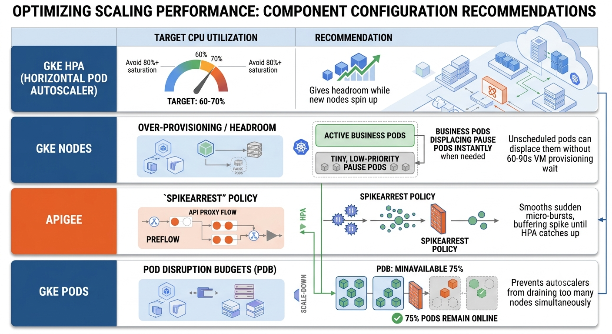

Scaling a Google Kubernetes Engine (GKE) cluster that runs backend microservices behind an API Gateway (like Apigee X) requires coordinating two distinct layers: **Application-layer scaling** (Pods) and **Infrastructure-layer scaling** (Nodes).

If pod scaling isn't aligned with node provisioning and gateway connection pooling, you risk gateway timeouts (`503` / `504` errors) during sudden traffic surges.

---

### The Two-Tier Scaling Architecture

```
[ Inbound Client Request ]
           │
           ▼
┌────────────────────────────────────────────────────────┐
│  API Gateway (Apigee X)                                │
│  • Rate limiting & SpikeArrest (protects backends)     │
│  • Connection Pooling & Keep-Alive                     │
└──────────────────────────┬─────────────────────────────┘
                           │
                 [ Cloud Load Balancer / PSC ]
                           │
                           ▼
┌────────────────────────────────────────────────────────┐
│  Tier 1: Workload Scaling (Horizontal Pod Autoscaler)  │
│  • Monitors CPU, Memory, or Ingress RPS                │
│  • Rapid scale-out: Pod count increases (e.g. 5 ──► 50)│
└──────────────────────────┬─────────────────────────────┘
                           │ Pods enter "Pending" state
                           ▼
┌────────────────────────────────────────────────────────┐
│  Tier 2: Node Scaling (GKE Autopilot / Karpenter)      │
│  • Detects unscheduled pods                            │
│  • Provisions new Compute Engine VMs into the cluster  │
└────────────────────────────────────────────────────────┘

```

---

### 1. Workload Layer: Horizontal Pod Autoscaler (HPA)

The HPA handles horizontal scaling of your microservice pods based on resource consumption or traffic metrics.

#### Step A: Configure Resource Requests and Limits

HPA cannot calculate scaling percentages unless your containers have precise resource requests defined:

```yaml
resources:
  requests:
    cpu: "250m"
    memory: "512Mi"
  limits:
    cpu: "1000m"
    memory: "1Gi"

```

#### Step B: Define the HPA with Fast Scale-Up Behavior

For microservices behind an API gateway, traffic spikes are often sharp. You want **immediate scale-up** and **conservative scale-down** to prevent flapping:

```yaml
apiVersion: autoscaling/v2
kind: HorizontalPodAutoscaler
metadata:
  name: payment-service-hpa
spec:
  scaleTargetRef:
    apiVersion: apps/v1
    kind: Deployment
    name: payment-service
  minReplicas: 3
  maxReplicas: 50
  metrics:
  - type: Resource
    resource:
      name: cpu
      target:
        type: Utilization
        averageUtilization: 65
  behavior:
    scaleUp:
      stabilizationWindowSeconds: 0 # React immediately
      policies:
      - type: Percent
        value: 100 # Double the pods every 15s if needed
        periodSeconds: 15
    scaleDown:
      stabilizationWindowSeconds: 300 # Wait 5 mins before scaling down
      policies:
      - type: Percent
        value: 10
        periodSeconds: 60

```

---

### 2. Infrastructure Layer: Node Autoscaling

When the HPA adds pods, the existing nodes will quickly run out of allocatable CPU/RAM. Any pod that cannot fit enters a `Pending` state, which triggers node provisioning.

Choose between two production approaches:

#### Option A: GKE Autopilot (Fully Managed)

* Google automatically provisions and rightsizes nodes on-demand based on incoming pod specs.
* Eliminates the need to manage node pools, machine types, or OS upgrades manually.

#### Option B: GKE Standard with Cluster Autoscaler & Node Auto-Provisioning (NAP)

* **Cluster Autoscaler (CAS):** Expands your existing node pool up to a defined ceiling:
```bash
gcloud container clusters update CLUSTER_NAME \
    --enable-autoscaling \
    --node-pool=POOL_NAME \
    --min-nodes=3 \
    --max-nodes=30 \
    --zone=COMPUTE_ZONE

```


* **Node Auto-Provisioning (NAP):** If incoming pods don't fit the existing node pool's machine type, NAP dynamically creates a new node pool with the optimal CPU/memory configuration.

---

### 3. API Gateway Synchronization

Scaling the GKE cluster alone is only half the equation. You must ensure the API Gateway and Kubernetes networking route traffic cleanly during scale events.

#### A. Graceful Pod Startup & Readiness Probes

When GKE adds a new pod, it takes time for the runtime (JVM, Node.js, Go) to boot:

* Ensure your deployment defines a **`readinessProbe`**.
* The pod will not be added to the GKE Service / Endpoint slice until the readiness probe passes. This prevents the API Gateway from forwarding requests to a cold container.

#### B. Graceful Pod Termination (`preStop` Hook)

When HPA scales down pods, in-flight API calls can be severed if containers terminate abruptly, causing `502 Bad Gateway` errors at Apigee:

```yaml
lifecycle:
  preStop:
    exec:
      command: ["/bin/sh", "-c", "sleep 15"]

```

* The `sleep 15` allows kube-proxy and the GCP Ingress controller to deregister the pod endpoint before the container receives `SIGTERM`.

#### C. Connection Pooling & Keep-Alive Alignment

* In Apigee's `TargetServer` or `HTTPTargetConnection`, configure `<KeepAliveTimeoutInSec>`.
* Set the gateway keep-alive timeout to be slightly **shorter** than the microservice's web server timeout (e.g., Nginx, Tomcat, Envoy). This avoids race conditions where the backend closes an idle connection right as the gateway attempts to reuse it.

---

### Production Scaling Checklist

